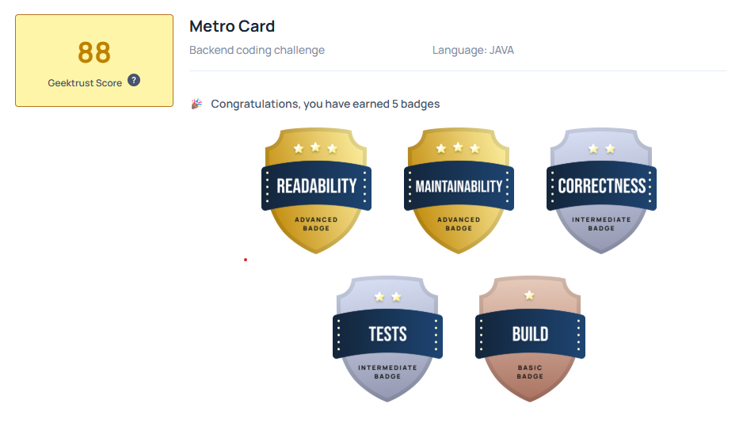

# 🚇 GeekTrust Challenge — Metro Card

  
  
  


> A clean, maintainable Java solution for the [GeekTrust Metro Card Problem](ProblemStatementByGeekTrust/MetroCardProblemStatement.md) — evaluated and **passed** on all GeekTrust assessment parameters: **Readability · Maintainability · Correctness · Tests · Build**.
  
---  


## What the Project Does

This application simulates a **metro card fare collection system** for a two-station train route (Central ↔ Airport).

Given a series of `BALANCE` and `CHECK_IN` commands from an input file, it:

- Loads initial metro card balances.
- Calculates travel fares based on **passenger type** (`ADULT`, `SENIOR_CITIZEN`, `KID`).
- Applies a **50% return-journey discount** when a passenger travels back on the same day.
- Auto-recharges cards when the balance is insufficient (with a **2% service fee** collected by the originating station).
- Prints a **per-station collection summary** (total collected + total discount) and a **passenger-type summary** sorted by count descending, then by name ascending.

---  

## Result by GeekTrust



---

## Few Highlights of Code

| Aspect | Detail |  
|---|---|  
| **Domain modelling** | Real-world fare rules encoded as clean domain objects |  
| **Extensibility** | New commands or passenger types can be added without touching existing logic |  
| **Testability** | Every layer is independently unit-testable via dependency injection |  
| **GeekTrust certified** | Passed automated evaluation on Readability, Maintainability, Correctness, Tests, and Build |  
  
---  

## Architecture & Design Patterns

The solution follows an **MVCS-like layered architecture** (Model · View · Controller/Command · Service) and intentionally applies three classical **LLD (Low-Level Design) design patterns** — making the codebase highly readable, extensible, and easy to maintain.

```  
┌──────────────────────────────────────────────┐  
│                   Main.java                  │  Entry point / Composition root  
├──────────────────────────────────────────────┤  
│       CommandInvoker  ◄──  CommandFactory    │  Command + Factory patterns  
├──────────────────────────────────────────────┤  
│        BalanceCommand │ CheckInCommand │     |  Command objects
|               PrintSummaryCommand            │   
├──────────────────────────────────────────────┤  
│        MetroCardService │ JourneyService     │  Service layer (business logic)  
├──────────────────────────────────────────────┤  
│    MetroCardRepository  │  StationRepository │  Repository layer (data access)  
├──────────────────────────────────────────────┤  
│      MetroCard │ Station │ PassengerType     │  Model layer + Strategy pattern  
└──────────────────────────────────────────────┘  
```  
  
---  

### MVCS-like Layered Architecture

| Layer | Classes | Responsibility |  
|---|---|---|  
| **Model** | `MetroCard`, `Station`, `PassengerType` | Domain state and core attributes |  
| **Repository** | `MetroCardRepository`, `StationRepository` | In-memory data access (CRUD abstraction) |  
| **Service** | `MetroCardService` / `MetroCardServiceImpl`, `JourneyService` / `JourneyServiceImpl` | Business rules: fare calculation, recharge logic, journey tracking, summary printing |  
| **Command (Controller)** | `BalanceCommand`, `CheckInCommand`, `PrintSummaryCommand` | Input parsing and delegating to the service layer |  

Each layer **depends only on the abstraction (interface) of the layer below it**, enabling easy swapping of implementations without touching callers.
  
---  

### Command Pattern

> **Intent: ** Encapsulate a request as an object, thereby decoupling the sender from the receiver and enabling extensible command processing.

- `Command` is a single-method interface (`execute(String[] tokens)`).
- Each concrete command handles **parsing its own tokens** and delegates business logic to the appropriate service.
- `CommandInvoker` is the *invoker* — it holds no knowledge of which command it runs; it simply calls `command.execute(tokens)`.

**Adding a new command** requires only creating a new class that implements `Command` and registering it in the factory — **zero changes to existing code**.

```java  
// CommandInvoker.java — the invoker is completely decoupled from command details  
public void invoke(String line) {  
 String[] tokens = line.trim().split("\\s+"); 
 Command command = commandFactory.getCommand(tokens[0]); 
 command.execute(tokens);
}  
```  
  
---  

### Factory Pattern

> **Intent:** Define an interface for creating objects but let a centralized factory decide which class to instantiate.

- `CommandFactory` acts as the **single creation point** for all command objects.
- The invoker never calls `new` on a command — it asks the factory, keeping object creation and object use separate.
- Unknown commands throw a `NoSuchCommandException`, keeping error handling explicit and typed.

```java  
// CommandFactory.java  
public Command getCommand(String commandName) {  
 switch (commandName.toUpperCase()) { 
 case "BALANCE": return new BalanceCommand(metroCardService); 
 case "CHECK_IN": return new CheckInCommand(journeyService); 
 case "PRINT_SUMMARY": return new PrintSummaryCommand(journeyService); 
 default: throw new NoSuchCommandException("No command found for: " + commandName); 
 }
}  
```  
  
---  

### Strategy Pattern

> **Intent: ** Define a family of algorithms, encapsulate each one, and make them interchangeable at runtime.


- `FareStrategy` is implemented directly by the `PassengerType` **enum**, cleanly binding each passenger type to its own fare computation.
- `JourneyServiceImpl` calls `passengerType.getBaseFare()` or `passengerType.getDiscountedFare()` **without any `if/switch` on type** — the polymorphism does the work.
- The `RETURN_DISCOUNT_RATE` constant (`0.5`) lives in the interface, providing a single source of truth for the discount policy.

```java  
// PassengerType.java — each enum constant IS a concrete strategy  
public enum PassengerType implements FareStrategy {  
 ADULT(200), SENIOR_CITIZEN(100), KID(50);  
 @Override 
 public int getBaseFare(){ return baseFare; } 
 @Override 
 public int getDiscountedFare() { return (int)(baseFare * RETURN_DISCOUNT_RATE); }
}  
  
// JourneyServiceImpl.java — consumes the strategy polymorphically  
int fare = isReturn ? passengerType.getDiscountedFare() : passengerType.getBaseFare();  
```  
  
---  

### Singleton Pattern (Repository Layer)

Both `MetroCardRepository` and `StationRepository` use the **Singleton** pattern to guarantee a single shared in-memory data store throughout the application's lifecycle — appropriate for an in-process, single-run command-line application.
  
---  

## Project Structure

```  
src/  
├── main/java/com/example/geektrust/  
│   ├── Main.java                          # Entry point & DI composition root  
│   ├── command/  
│   │   ├── Command.java                   # Command interface  
│   │   ├── CommandInvoker.java            # Invoker  
│   │   ├── BalanceCommand.java            # Handles BALANCE input  
│   │   ├── CheckInCommand.java            # Handles CHECK_IN input  
│   │   └── PrintSummaryCommand.java       # Handles PRINT_SUMMARY input  
│   ├── factory/  
│   │   └── CommandFactory.java            # Creates Command instances  
│   ├── model/  
│   │   ├── MetroCard.java                 # Domain: card with balance  
│   │   ├── Station.java                   # Domain: station with collection stats  
│   │   └── PassengerType.java             # Enum + FareStrategy implementation  
│   ├── repository/  
│   │   ├── MetroCardRepository.java       # In-memory card storage (Singleton)  
│   │   └── StationRepository.java         # In-memory station storage (Singleton)  
│   ├── service/  
│   │   ├── MetroCardService.java          # Service interface  
│   │   ├── JourneyService.java            # Service interface  
│   │   └── impl/  
│   │       ├── MetroCardServiceImpl.java  # Recharge & balance management  
│   │       └── JourneyServiceImpl.java    # Fare calculation & summary  
│   ├── strategy/  
│   │   └── FareStrategy.java              # Strategy interface for fare calculation  
│   └── exceptions/  
│       ├── InvalidPassengerTypeException.java  
│       ├── NoSuchCommandException.java  
│       └── ResourceNotFoundException.java  
└── test/java/com/example/geektrust/  
	├── command/                           # Unit tests for command layer 
	├── factory/                           # Unit tests for factory 
	├── model/                             # Unit tests for domain models 
	└── service/                           # Unit tests for service layer
```
  
---  

## Getting Started

### Prerequisites

| Tool | Version |  
|---|---|  
| Java JDK | 8+ |  
| Gradle | 5.1 (wrapper included — no installation needed) |  

### Build

```bash  
# Windows  
gradlew.bat build  
  
# Linux / macOS  
./gradlew build  
```  

This compiles the source, runs all tests, and produces `build/libs/geektrust.jar`.

### Run

```bash  
# Windows  
gradlew.bat run --args="<path-to-input-file>"  
  
# Or directly with the JAR  
java -jar build/libs/geektrust.jar <path-to-input-file>  
  
# Quick run with the provided sample inputs  
gradlew.bat run --args="sample_input/input1.txt"  
gradlew.bat run --args="sample_input/input2.txt"  
```  

### Test

```bash  
# Run all unit tests  
gradlew.bat test  
  
# Run tests and generate JaCoCo coverage report  
gradlew.bat test jacocoTestReport  
# Report output: jacoco.xml  
```  
  
---  

## 📄 Input / Output Format

### Input file

```  
BALANCE <METROCARD_NUMBER> <INITIAL_BALANCE>  
CHECK_IN <METROCARD_NUMBER> <PASSENGER_TYPE> <FROM_STATION>  
PRINT_SUMMARY  
```  

| Field | Values |  
|---|---|  
| `PASSENGER_TYPE` | `ADULT`, `SENIOR_CITIZEN`, `KID` |  
| `FROM_STATION` | `CENTRAL`, `AIRPORT` |  

### Output

```  
TOTAL_COLLECTION <STATION_NAME> <TOTAL_COLLECTED> <TOTAL_DISCOUNT>  
PASSENGER_TYPE_SUMMARY  
<PASSENGER_TYPE> <COUNT>  
...  
```  

Passenger types are listed in **descending order of count**; ties are broken by **ascending alphabetical order** of passenger type name.
  
---  

## Sample I/O

### Input (`sample_input/input1.txt`)

```  
BALANCE MC1 600  
BALANCE MC2 500  
BALANCE MC3 50  
BALANCE MC4 50  
BALANCE MC5 200  
CHECK_IN MC1 ADULT CENTRAL  
CHECK_IN MC2 SENIOR_CITIZEN CENTRAL  
CHECK_IN MC1 ADULT AIRPORT  
CHECK_IN MC3 KID AIRPORT  
CHECK_IN MC4 ADULT AIRPORT  
CHECK_IN MC5 KID AIRPORT  
PRINT_SUMMARY  
```  

### Expected Output

```  
TOTAL_COLLECTION CENTRAL 300 0  
PASSENGER_TYPE_SUMMARY  
ADULT 1  
SENIOR_CITIZEN 1  
TOTAL_COLLECTION AIRPORT 403 100  
PASSENGER_TYPE_SUMMARY  
ADULT 2  
KID 2  
```  

> **Explanation of AIRPORT total: ** MC3 had balance 50 (KID fare = 50 no recharge). MC4 had balance 50 (ADULT fare = 200 → recharge 150 + 2% service fee = 3 → charged 203). MC1 return journey ADULT = 100 (50% discount). MC5 KID = 50. Total = 50 + 203 + 100 + 50 = 403.
   
---  

## Maintainer

Developed as a demonstration of **clean code principles** and **LLD design pattern proficiency** in Java. The solution intentionally showcases:

- ✅ **Command Pattern** — extensible, decoupled command processing pipeline
- ✅ **Factory Pattern** — centralized, single-responsibility object creation
- ✅ **Strategy Pattern** — polymorphic fare computation via `PassengerType` enum
- ✅ **MVCS-like layered architecture** — clear separation of concerns across Model, Repository, Service, and Command layers
- ✅ **Interface-driven design** — services depend on abstractions, not implementations
- ✅ **Custom exception hierarchy** — typed, meaningful error propagation

---  